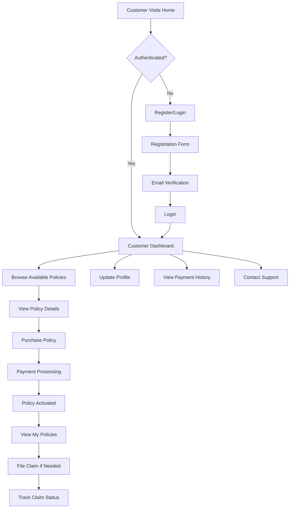
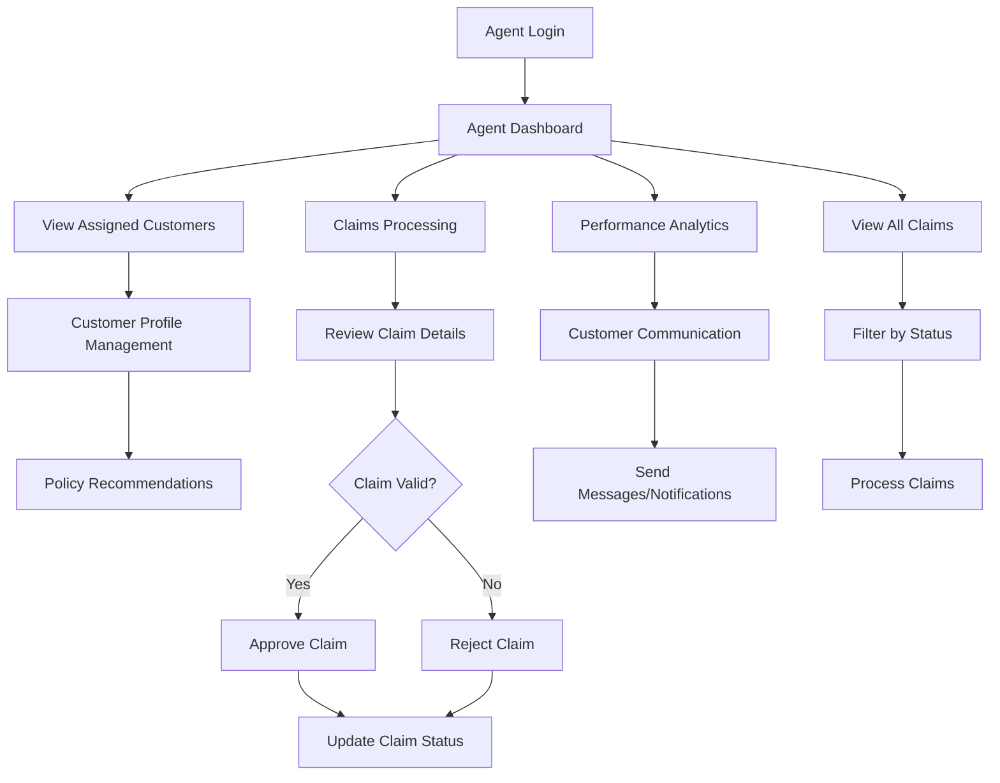
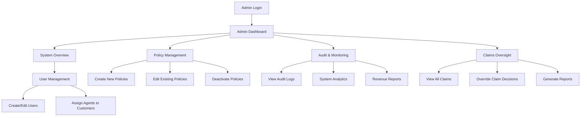
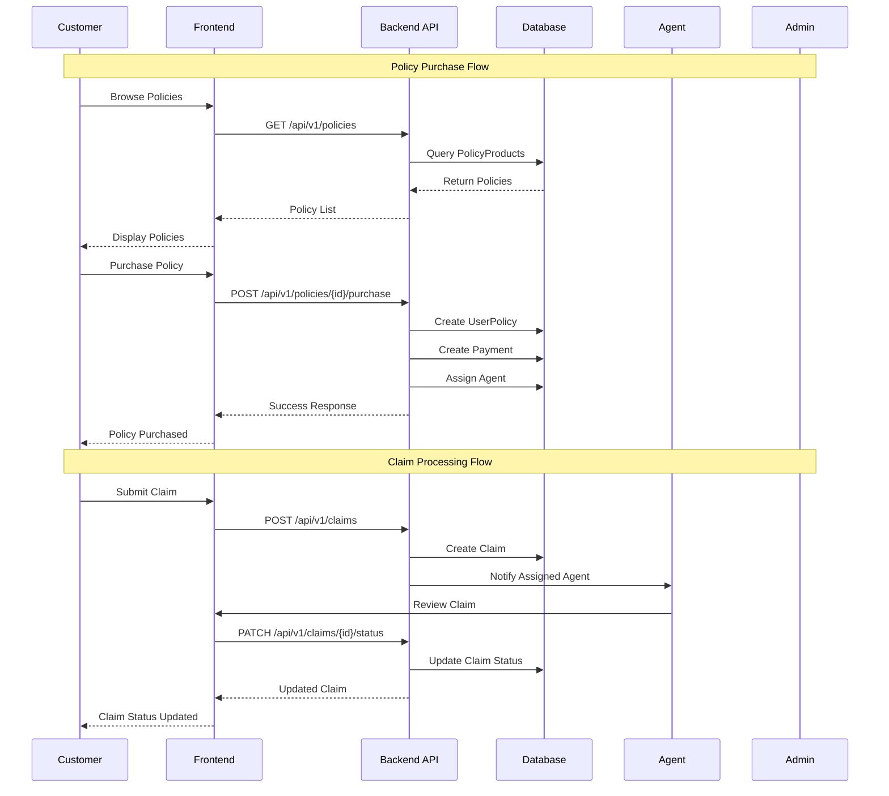
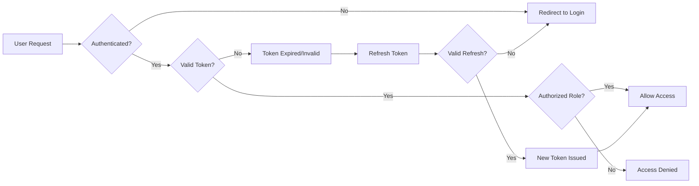

# 🏥 Insurance Policy Management System - Complete Workflow Diagram

## System Architecture Overview

```mermaid
graph TB
    subgraph "Frontend (Angular 18)"
        A[Home Page] --> B[Authentication]
        B --> C[Customer Dashboard]
        B --> D[Agent Dashboard] 
        B --> E[Admin Dashboard]
        
        C --> F[Browse Policies]
        C --> G[My Policies]
        C --> H[Submit Claims]
        C --> I[Payments]
        
        D --> J[Manage Customers]
        D --> K[Process Claims]
        D --> L[Performance Reports]
        
        E --> M[User Management]
        E --> N[Policy Management]
        E --> O[Audit Logs]
        E --> P[System Analytics]
    end
    
    subgraph "Backend (Node.js/Express)"
        Q[REST API v1] --> R[Authentication Service]
        Q --> S[Policy Service]
        Q --> T[Claim Service]
        Q --> U[Payment Service]
        Q --> V[Admin Service]
        Q --> W[Agent Service]
        
        R --> X[JWT Middleware]
        S --> Y[Policy Controller]
        T --> Z[Claim Controller]
        U --> AA[Payment Controller]
        V --> BB[Admin Controller]
        W --> CC[Agent Controller]
    end
    
    subgraph "Database (MongoDB)"
        DD[Users Collection]
        EE[PolicyProducts Collection]
        FF[UserPolicies Collection]
        GG[Claims Collection]
        HH[Payments Collection]
        II[AuditLogs Collection]
    end
    
    A --> Q
    Q --> DD
    Q --> EE
    Q --> FF
    Q --> GG
    Q --> HH
    Q --> II
```

## Complete User Workflow

### 1. Customer Journey

### 2. Agent Workflow

### 3. Admin Workflow

## Data Flow Architecture

## System Components & Technologies

### Frontend Stack
- **Framework**: Angular 18
- **Language**: TypeScript
- **Styling**: Tailwind CSS
- **State Management**: RxJS Observables
- **Routing**: Angular Router with Guards
- **Authentication**: JWT Token Management

### Backend Stack
- **Runtime**: Node.js
- **Framework**: Express.js
- **Database**: MongoDB with Mongoose ODM
- **Authentication**: JWT + bcrypt
- **API**: RESTful API (v1)
- **Additional**: GraphQL Support

### Database Schema
- **Users**: Customer, Agent, Admin roles
- **PolicyProducts**: Insurance policy templates
- **UserPolicies**: Customer-purchased policies
- **Claims**: Insurance claims with status tracking
- **Payments**: Payment records and history
- **AuditLogs**: System activity tracking

## Key Features & Capabilities

### Customer Features
- ✅ User Registration & Authentication
- ✅ Policy Browsing & Purchase
- ✅ Policy Management (View, Cancel)
- ✅ Claim Submission & Tracking
- ✅ Payment History
- ✅ Profile Management
- ✅ Real-time Notifications

### Agent Features
- ✅ Customer Management
- ✅ Claim Processing & Approval
- ✅ Performance Analytics
- ✅ Customer Communication
- ✅ Policy Recommendations
- ✅ Dashboard Analytics

### Admin Features
- ✅ Complete User Management
- ✅ Policy Creation & Management
- ✅ System-wide Analytics
- ✅ Audit Log Monitoring
- ✅ Revenue Tracking
- ✅ Agent Performance Management

## Security & Access Control

## API Endpoints Summary

### Public Endpoints
- `GET /api/v1/policies` - List all policies
- `GET /api/v1/policies/:id` - Get policy details
- `POST /api/v1/auth/register` - User registration
- `POST /api/v1/auth/login` - User login

### Protected Endpoints (Customer)
- `GET /api/v1/user/policies` - Get user's policies
- `POST /api/v1/policies/:id/purchase` - Purchase policy
- `POST /api/v1/claims` - Submit claim
- `GET /api/v1/claims` - Get user's claims
- `PUT /api/v1/user/policies/:id/cancel` - Cancel policy

### Agent Endpoints
- `GET /api/v1/agents/claims` - Get assigned claims
- `PATCH /api/v1/claims/:id/status` - Update claim status
- `GET /api/v1/agents/customers` - Get assigned customers
- `GET /api/v1/agents/performance` - Get performance data

### Admin Endpoints
- `POST /api/v1/policies` - Create policy
- `GET /api/v1/admin/users` - Get all users
- `GET /api/v1/admin/audit` - Get audit logs
- `GET /api/v1/admin/summary` - Get system summary

## Testing & Quality Assurance

- ✅ **266 Test Cases** - Comprehensive test coverage
- ✅ **100% Test Success Rate** - All tests passing
- ✅ **Component Testing** - Angular component tests
- ✅ **Service Testing** - API service tests
- ✅ **Integration Testing** - End-to-end workflows
- ✅ **Error Handling** - Comprehensive error management

## Deployment & Scalability

### Development Setup
1. **Backend**: `cd backend && npm run dev`
2. **Frontend**: `cd frontend && npm start`
3. **Database**: MongoDB running on localhost:27017
4. **Access**: Frontend on http://localhost:4200, Backend on http://localhost:5000

### Production Considerations
- Environment-based configuration
- Database connection pooling
- JWT secret management
- CORS configuration
- Error logging and monitoring
- API rate limiting
- Data backup strategies

---

**This comprehensive workflow diagram covers all aspects of your Insurance Policy Management System, from user interactions to database operations, making it perfect for presentations and documentation.**
